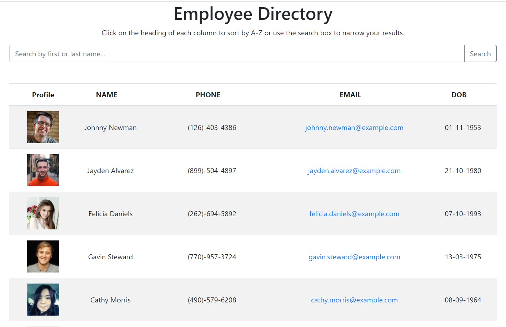
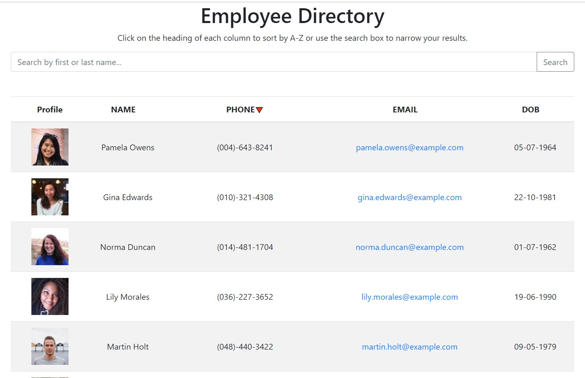
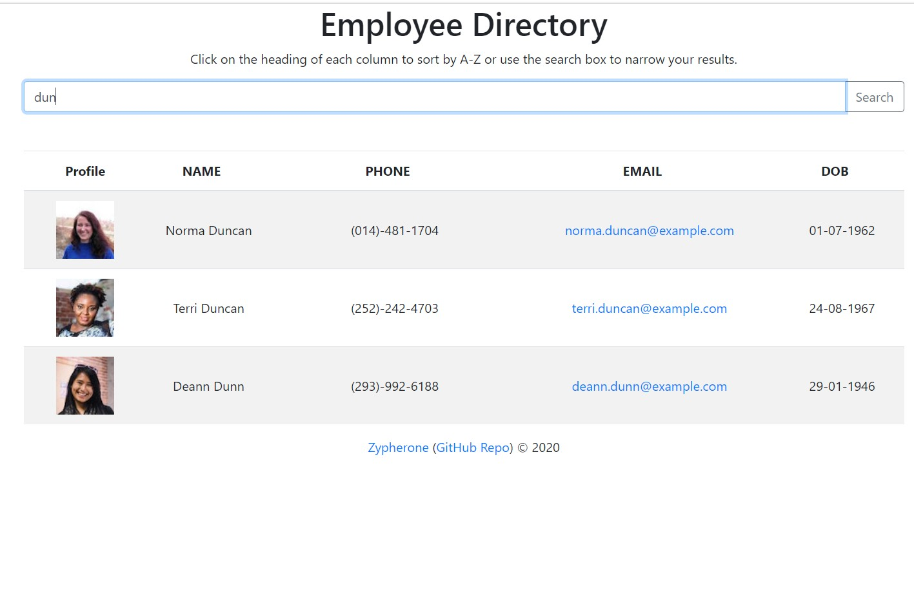

[contributors-shield]: https://img.shields.io/github/contributors/Zypherone/employer-directory.svg?style=flat-square
[contributors-url]: https://github.com/Zypherone/employer-directory/graphs/contributors
[forks-shield]: https://img.shields.io/github/forks/Zypherone/employer-directory.svg?style=flat-square
[forks-url]: https://github.com/Zypherone/employer-directory/network/members
[stars-shield]: https://img.shields.io/github/stars/Zypherone/employer-directory.svg?style=flat-square
[stars-url]: https://github.com/Zypherone/employer-directory/stargazers
[issues-shield]: https://img.shields.io/github/issues/Zypherone/employer-directory.svg?style=flat-square
[issues-url]: https://github.com/Zypherone/employer-directory/issues
[build-style-shield]: https://img.shields.io/badge/code%20style-standard-brightgreen.svg?style=flat
[build-style-url]: https://github.com/feross/standard
[license-shield]: https://img.shields.io/github/license/Zypherone/employer-directory.svg?style=flat-square
[license-url]: http://choosealicense.com/licenses/mit/

[![Contributors][contributors-shield]][contributors-url] [![Forks][forks-shield]][forks-url] [![Stargazers][stars-shield]][stars-url] [![Issues][issues-shield]][issues-url] [![JS Standard][build-style-shield]][build-style-url] [![MIT License][license-shield]][license-url]

# Unit 19 React Homework: Employee Directory
An employee or manager would benefit greatly from being able to view non-sensitive data about other employees. It would be particularly helpful to be able to filter employees by name.

#### Table of Contents
- [Screenshots](#Screenshots)
- [Built With](#Built_With)
- [Code Style](#Code_Style)
- [Installation](#Installation)
- [Demo](#Demo)
- [Usage](#Usage)
- [Credits](#Credits)
- [Contributing](#Contributing)
- [License](#License)

---

## Screenshots
|Screenshot One|Screenshot Two|Screenshot Three|
|----|----|----|
||||

## Built with
- [React.js](https://reactjs.org/))
- [normalize.css](http://necolas.github.io/normalize.css/)

## Code style
[![JS Standard][build-style-shield]][build-style-url] - https://github.com/standard/standard

---

## Installation

Download (and unpack) or clone the repo. In the project directory, you can run:

### `npm start`

Runs the app in the development mode. 
Open [http://localhost:3000](http://localhost:3000) to view it in the browser.

The page will reload if you make edits. 
You will also see any lint errors in the console.

### `npm test`

Launches the test runner in the interactive watch mode. 
See the section about [running tests](https://facebook.github.io/create-react-app/docs/running-tests) for more information.

### `npm run build`

Builds the app for production to the `build` folder. 
It correctly bundles React in production mode and optimizes the build for the best performance.

The build is minified and the filenames include the hashes. 
Your app is ready to be deployed!

See the section about [deployment](https://facebook.github.io/create-react-app/docs/deployment) for more information.

### `npm run eject`

**Note: this is a one-way operation. Once you `eject`, you can’t go back!**

If you aren’t satisfied with the build tool and configuration choices, you can `eject` at any time. This command will remove the single build dependency from your project.

Instead, it will copy all the configuration files and the transitive dependencies (webpack, Babel, ESLint, etc) right into your project so you have full control over them. All of the commands except `eject` will still work, but they will point to the copied scripts so you can tweak them. At this point you’re on your own.

You don’t have to ever use `eject`. The curated feature set is suitable for small and middle deployments, and you shouldn’t feel obligated to use this feature. However we understand that this tool wouldn’t be useful if you couldn’t customize it when you are ready for it.

### Learn More

You can learn more in the [Create React App documentation](https://facebook.github.io/create-react-app/docs/getting-started).

To learn React, check out the [React documentation](https://reactjs.org/).

## Demo

Click https://zypherone-19-react.herokuapp.com/ to visit a live demo.

## Usage 
The primary purpose of this was to meet the requirements of a homework assignment. The major goal is to create a employee directory with React. This assignment will require me to break up the application's UI into components, manage component state, and respond to user events.

## Credits 
I created this code based on the homework prompt created by Triology Education Services. Certain pieces of code I used online resources for help. 

## Contributing 
I was the only one to work on this project, but of course I had help from my instructor, TA's, and classmates.

## License
| Details | Author |
|---|---|
|This project is licensed under the MIT License - see [choosealicense.com](http://choosealicense.com/licenses/mit/) for more details. A short and simple permissive license with conditions only requiring preservation of copyright and license notices. Licensed works, modifications, and larger works may be distributed under different terms and without source code.   |  |
